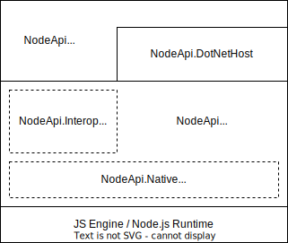

## Node API Project Layers

Solid lines separate assemblies; dotted lines separate namespaces within an assembly. Assemblies may depend only on other assemblies immediately below them. (Namespaces within an assembly may be inter-dependent.)

Note that while the native API layer could be split into a separate assembly from a layering perspective, it is better to keep it together with the main class library:
 - Performance should be better: the native API layer includes many simple and frequently-called methods that are likely to be inlined by the compiler. But inlining isn't possible if they are in a separate assembly. Also loading an extra assembly contributes to startup time.
 - Practically, the native API layer is not very useful on its own, so it would just be an inconvenience to always have to bundle it with the main class library.

Following is a description of the layered assemblies and namespaces, from the bottom up.

### Microsoft.JavaScript.NodeApi assembly (.NET & AOT)
 - `Microsoft.JavaScript.NodeApi.Native` namespace - Exposes all the `napi_*` APIs for general JavaScript engine interop
 - `Microsoft.JavaScript.NodeApi.Native.NodeJS` namespace - Exposes all the `napi_*` APIs that are specific to the Node.js runtime (and other application runtimes that implement the same APIs).
 - `Microsoft.JavaScript.NodeApi` namespace - Core JavaScript value types, along with some basic supporting types like `JSException`, `JSExportAttribute`, `JSCallbackArgs`, `JSReference`, `JSPropertyDescriptor`
 - `Microsoft.JavaScript.NodeApi.Collections` namespace - JS collection types including `JSIterable`, `JSArray`, `JSTypedArray`, `JSSet`, `JSMap`, and supporting code.
 - `Microsoft.JavaScript.NodeApi.Interop` namespace - Types that directly support richer interop between .NET and JavaScript, including `JSContext`, The `*Builder*` types, and `JSCallbackOverload`. Also includes threading support in `JSSynchronizationContext`, `JSAsyncScope`.
 - `Microsoft.JavaScript.NodeApi.DotNetHost` namespace - Only the `NativeHost` class must be in the main assembly because it gets AOT-compiled. (The class doesn't need to have `public` accessibility though.)

### Microsoft.JavaScript.NodeApi.DotNetHost assembly (.NET only)
  - `Microsoft.JavaScript.NodeApi.DotNetHost` namespace - Supports static binding to .NET assemblies built as Node API modules as well as dynamic binding to arbitrary .NET assemblies / APIs. Includes `ManagedHost`, `JSMarshaler`, and supporting types.

### Microsoft.JavaScript.NodeApi.Generator assembly (.NET only)
 - `Microsoft.JavaScript.NodeApi.Generator.CSharp` namespace - A C# source generator that emits code at compile time that enables JavaScript to statically bind to .NET APIs in the compiled assembly.
 - `Microsoft.JavaScript.NodeApi.Generator.TypeScript` - A command-line tool that generates TypeScript type definitions for either statically- or dynamically-bound .NET assemblies.
