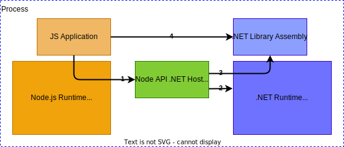
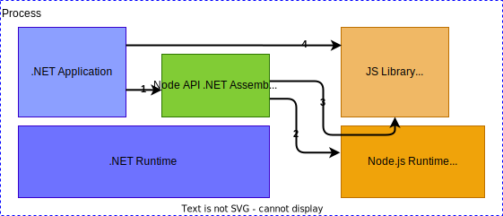

<!--
  Use the Marp CLI or Marp for VS Code to generate slides from this markdown file:
    https://github.com/marp-team/marp-cli
    https://github.com/marp-team/marp-vscode
-->


<br>

# **Node API for .NET**

High-performance in-proc interop<br/> between .NET and JavaScript

[github.com/microsoft/node-api-dotnet](https://github.com/microsoft/node-api-dotnet)
Jason Ginchereau jasongin@microsoft.com
Vladimir Morozov vmorozov@microsoft.com

---
## Project Vision

First-class in-proc interoperability between .NET and JavaScript
<br/>

### Motivation
.NET and JavaScript are widely used, and often complementary, but there is not a great interop story between them.

While some limited solutions exist, there are opportunities to do better in many ways!

---
## Primary .NET / JS Interop scenarios
- Dynamically invoke .NET APIs from JS.
- Develop Node.js addon modules in C#.
- Host a JS runtime within a .NET app and call JS APIs from .NET.
- Develop React Native apps and extensions in C# with JS interop.

Requirements:
 - .NET 6 or later / .NET Framework 4.7.2 or later
 - Windows, Mac, or Linux

---
## Dynamically invoke .NET APIs from JS
```js
const dotnet = require('node-api-dotnet');
dotnet.Console.WriteLine('Hello from .NET!');

const MyAssembly = dotnet.load('path/to/MyAssembly.dll');
const myObj = new MyAssembly.MyClass(...args);
```

<br/><br/>
_Dynamic invocation has some limitations, e.g. some forms of generics, ref/out params. These can be reduced or eliminated with further development._

---
## Develop Node addon modules in C#
```C#
// C#
[JSExport]
public class MyClass {
    public MyClass(string[] args) { }
}
```
```ts
// TypeScript
import { MyClass } from 'my-package';
const myObj = new MyClass(...args);
```

Option: Use .NET Native AOT to avoid .NET Runtime dependency.

---
## TypeScript type definitions
JavaScript or TypeScript code can reference type definitions for .NET APIs.
 - A tool generates typedef files (`.d.ts`) from .NET assemblies.
 - Nuget package MSBuild scripts automatically do this for C# Node addon projects.

---
## Demo
Calling Azure OpenAI from JavaScript using the .NET
[Semantic Kernel](https://github.com/microsoft/semantic-kernel) client library



---
## Host a JS runtime in a .NET app
```C#
// C#
[JSImport]
interface IExample
{
    void ExampleMethod(string arg);
}

var example = nodejs.Import<IExample>(
    "example-npm-package", "ExampleObject");
example.ExampleMethod(arg);
```
---
## Demo
C# WinUI collaborative text editing using JS [Fluid Framework](https://fluidframework.com/)



---
## About Node API
- C-style ABI stable API.
- Initial goals:
  - Support Chakra JS engine along with V8 for Node.js.
  - Write addons across Node.js versions without recompiling.

&nbsp;
https://nodejs.org/api/n-api.html

---
## About Node API (cont.)
- Evolved to a de-facto standard for JavaScript interoperability with other languages:
  - Implemented by several JS runtimes: Node.js, Electron, Deno, Bun, WASM, etc.
  - Implemented on top of several JS engines: V8, Chakra, JSC, Hermes, JerryScript, etc.
  - Has bindings for different languages: C++, Rust, Go, Zig, and now C# (!)

---
## About Node API (cont.)
- The same addon can be reused with minimal changes across multiple JS runtimes.
- node-api-dotnet project allows C# code to be part of the Node-API universe:
  - write C# addons for popular JS runtimes;
  - interop between JS and popular C# frameworks.

_Developers of the Node API for .NET project are current/former members of the Node.js [Node API working group](https://github.com/nodejs/abi-stable-node/)._

---
## Demo
Hosting the [Hermes JavaScript engine](https://github.com/facebook/hermes) in a .NET app.
- JavaScript engine created by Meta.
- Optimized for React Native applications.
  - Interpreter only.
  - Small size and fast startup time.
  - JS byte code distribution with apps to save on JS parsing.
  - Not all ES6 constructs are supported yet.
- Node-API is implemented in the [Hermes-Windows](https://github.com/microsoft/hermes-windows) fork.

---
## Low-level JS interop
Node API is a set of C functions, for example:
```C
napi_status napi_create_function(
    napi_env env, const char* utf8name, size_t length,
    napi_callback cb, void* data, napi_value* result);
```

They are wrapped in a layer of .NET types for JS primitives:
    `JSValue`, `JSObject`, `JSArray`, `JSMap`, `JSPromise`, etc.

```C#
JSValue.CreateFunction("greeter", (JSCallbackArgs args) =>
{
    return (JSValue)$"Hello {(string)args[0]}!";
});
```

---
## High-level .NET / JS interop
 - Automatic marshalling for:
   - Classes & interfaces - passed by reference
   - Structs & enums - passed by value
   - Collections - passed by reference
   - TypedArrays - using shared memory
 - Async support:
   - Automatic conversion between Tasks & Promises
   - SynchronizationContext supports `await` return to JS thread

---
## More interop features
 - Error/exception propagation
 - .NET delegates / JS callbacks
 - .NET Streams / Node Readable, Writable, Duplex streams
 - JS class can extend a .NET class, TS can implement a .NET interface
 - .NET class can implement a TS interface

---
## .NET Native AOT
 - AOT C# code uses .NET hosting APIs to load .NET in-proc.
   - .NET 6+: `hostfxr`
   - .NET 4.x: `mscoree`
   - _No need for C++_
 - Alternatively, C# Node addon modules can be AOT compiled.
   - JS marshalling leverages source-generation.

---
## .NET Code Generation
Expression trees + source generators enable both runtime and compile-time generation of JS marshalling code.
1. Use .NET reflection to generate _expression trees_ for converting between .NET and JS.
2. At compile time, emit expressions as C#. (Supports AOT.)
3. At run time, compile directly to delegates. (Does not support AOT.)

---
## Interop performance
.NET / JS interop is fast because:
 - Marshaling does not use JSON serialization.
 - Compile-time or runtime code generation avoids reflection.
 - Use of shared memory and proxies minimizes data transfer.
 - `struct`, `Span<T>`, `stackalloc` minimize heap allocation & copying.

---
## Performance comparison
Warm JS to .NET calls are nearly twice as fast when compared to `edge-js` using [that project's benchmark](https://github.com/tjanczuk/edge/wiki/Performance).

|      |  HTTP | Edge.js | Node API .NET | AOT | JS (baseline) |
|-----:|------:|--------:|--------------:|----:|--------------:|
| Cold | 32039 |   38761 |          9355 | 362 |          1680 |
| Warm |  2003 |      87 |            54 |  47 |            23 |

Numbers are _microseconds_. "Warm" is an average of 10000 .NET -> JS calls (passing a medium-size object).

---
## Project status
 - Available for early experimentation
   - Send feedback, bug reports to [microsoft/node-api-dotnet/issues](https://github.com/microsoft/node-api-dotnet/issues)
   - Help prioritize areas for improvement.
   - Contribute PRs!
 - Current limitations may block some advanced interop scenarios.
 - NOT production ready

---
## Roadmap
Major development areas:
 - More marshalling: events, generics, ...
 - API review / refinement
 - More test coverage

Project backlog: https://github.com/orgs/microsoft/projects/779
